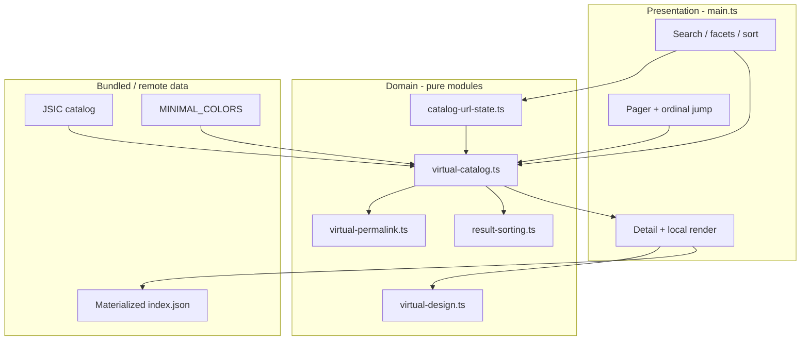

# Virtual Catalog (issue #71)

Last updated: 2026-07-25

Versioned canonical virtual space for the Matrix static web UI. Exact filtered
counts and page materialization are O(axis sizes), never O(total cells).

## Legend

- Blue UI nodes: DOM wiring only
- Green domain nodes: deterministic, DOM-free, unit-tested
- Gray data nodes: bundled axes or fetched materialized bodies
